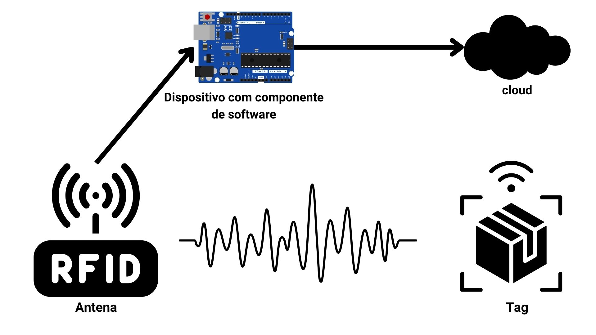
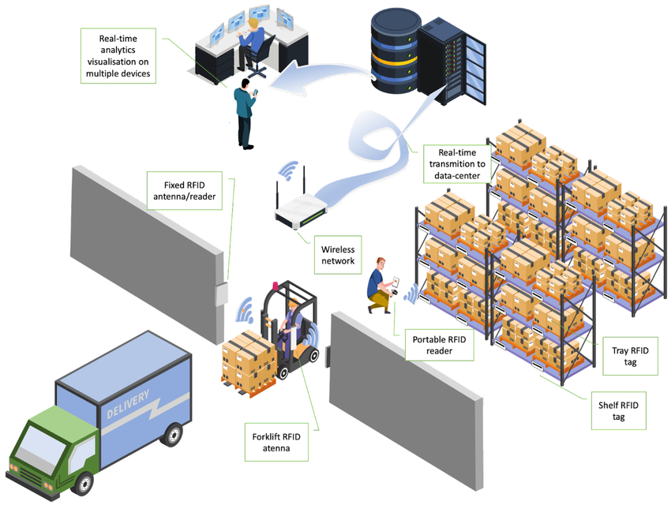
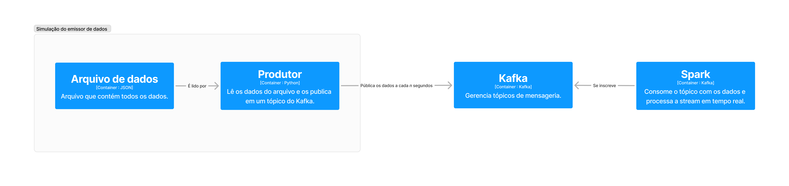

# Trabalho de Processamento de Dados em Escala

Este repositório contém o código e a documentação acerca do trabalho realizado para a disciplina **Processamento de Dados em Escala** (1001515) no primeiro semestre de 2024 pelo curso de Ciência da Computação pela Universidade Federal de São Carlos.

# Contextualização

Iremos utilizar nesta aplicação dados de leitura RFID. Iremos explicar brevemente sobre RFID e seus usos.

## O que é RFID?

RFID significa *Radio Frequency Identification* (Identificação por Radiofrequência). É uma tecnologia que permite a identificação de objetos à distância, sem a necessidade de contato físico. A tecnologia RFID é composta por três elementos básicos: um transponder (ou tag), um leitor e um sistema de software.

Em um sistema usual, o fluxo de dados se parece com o diagrama abaixo.

- A antena emite sinais de rádio
- A tag é energizada por esses sinais quando entra no alcance da antena, e responde com um sinal contendo suas informações
- Um controlador (leitor) recebe os dados da antena e os envia para algum componente externo, usualmente alguma solução de cloud

## Como o RFID é utilizado

Há muitos usos para tags RFID, mas no contexto deste trabalho, focaremos em controle de estoque. Popularizado pelo Walmart pelos anos 2010, este tipo de tecnologia permite automatizar a passagem de caixas contendo estas tags por alguns checkpoints, falicitanto imensagemente o controle de recebimento em escala.

Fonte: [Link](https://www.researchgate.net/figure/The-concept-of-RFID-based-warehouse-management-system_fig5_365304684).

## Desafios em lidar com RFID

Os principais desafios deste tipo de tecnologia são:
- **Ruído**: Dados ruidosos são comuns, e podem ser causados por reflexão de sinal, interferência eletromagnética, ou mesmo falhas no hardware.
- **Volume**: Em aplicações reais, o volume de dados é muito grande, e pode ser necessário processar estes dados em tempo real, como fazemos neste exemplo.
- **Latência**: Em aplicações de controle de estoque, a latência é um fator crítico, e é necessário que o processamento seja feito o mais rápido possível.

Dentre outros, a variar pelo caso de uso.

# Sobre esta aplicação

A aplicação aqui proposta realiza a filtragem de dados ruidosos recebidos a partir de uma *stream*, propagando dados limpos em tempo real para serem consumidos por outro módulo que efetue a lógica de negócios.

## Sobre os dados utilizados

> ⚠️ Os dados aqui utilizados foram cedidos pela empresa **Centro de Pesquisas Avançadas Wernher von Braun**, para os fins desta disciplina, com devida materialização destas permissões por registro eletrônico.

Os dados utilizados representam leituras captadas por leitores de RFID no contexto de uma aplicação de controle de estoque de ármazem. Há muitos registros, superando 8 milhões.

Os dados são bastante simples. Seus campos pertinentes são:
- **read_timestamp**: O timestamp da leitura
- **epc**: Identificador único da tag
- **RSSID**: Received Signal Strengh Indicator. Intensidade do sinal recebido

## Infraestrutura utilizada

Buscamos simular um caso real através da seguinte arquitetura. Para alcançá-la, utilizamos o orquestrador de containers **Docker Compose**, parte do Docker.

- Os dispositivos IoT, Tag, antena e controlador, são substituídos pelo grupo **Simulação do emissor de dados**
  - Utilizamos o arquivo JSON com os dados reais
  - Utilizamos um script utilitário que lê estes dados e os publica a cada 1 segundo em um tópico do Kafka
- Nossa cloud é composta por:
  - Um container Kafka que mantém o tópico de publicação e leitura dos dados
  - Um container que utiliza Spark para consumir este tópico em tempo real, processá-los e exportar o resultado em um arquivo ou stream (console)

## Operação de processamento realizada

- Filtragem de dados ruidosos, que apresentem RSSID incompatível com o de uma leitura próxima de uma antena
- Agrupamento de leituras próximas utilizando uma janela de tempo para agrupá-las e transformá-las em um evento
